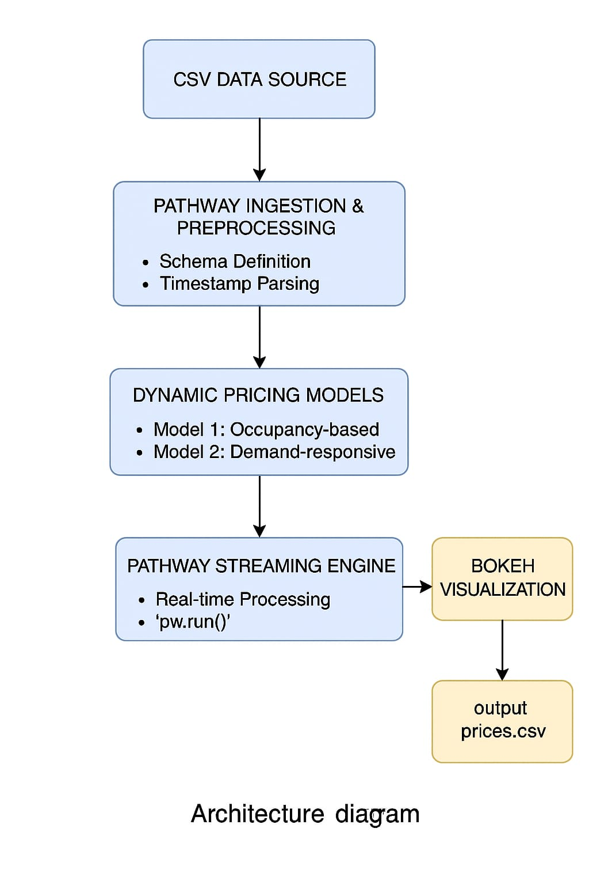

# Dynamic_parking_price

Dynamic Parking Price Optimization

This project implements a real-time dynamic pricing system for parking spaces using data streaming, Pathway, and Bokeh for visualization. It compares two pricing models based on live occupancy data, traffic conditions, queue length, and more.

---

⚠ GitHub Notebook Preview Issue

If you're seeing the message:

>  "Invalid Notebook"

The notebook is not broken. This happens because GitHub sometimes fails to preview .ipynb files generated by Colab, due to extra metadata or output size.

✅ You can still run it using:

▶ Google Colab:

Please open the notebook in Colab:

https://colab.research.google.com/github/Lasya-Masuldar/Dynamic_parking_price/blob/main/Sample_Notebook.ipynb

💻 Locally via Jupyter:

git clone https://github.com/Lasya-Masuldar/Dynamic_parking_price.git
cd Dynamic_parking_price
jupyter notebook Sample_Notebook.ipynb

---

🚀 Tech Stack Used

Google Colab: Interactive notebook environment

Python: Core language

Pandas: CSV preprocessing

Pathway: Real-time data streaming and processing

Bokeh: Interactive visualizations

Panel: Bokeh app embedding

---

📊 Architecture Overview

🔄 Data Flow

1. Input: Real-time streaming of parking data via pw.demo.replay_csv()

2. Windowing: Daily tumbling windows using Pathway

3. Aggregation: Min/max occupancy and capacity, queue length, vehicle types, etc.

4. Price Models:

Model 1: Simple linear pricing based on occupancy ratio

Model 2: Weighted model based on demand factors

5. Clamping: Price clipped between ₹5 and ₹20

6. Output: Results written to CSV and visualized in Bokeh

---

🧭 Architecture Diagram

---

💸 Pricing Models

Model 1: Simple Linear Pricing

price_model1 = 10 + 4 * (occupancy / capacity)

Model 2: Demand-Based Dynamic Pricing

demand = 0.2 * (occupancy / capacity) +
         0.1 * queue_length -
         0.1 * traffic_heavy +
         0.05 * is_special_day +
         0.15 * vehicle_type_weight

price_model2 = 10 * (1 + 0.5 * demand)

---

📈 Real-Time Visualizations (Bokeh)

Real-time line plot of pricing

Automatically updates per day

Highlights changes in demand behavior

---

📎 Files

Sample_Notebook.ipynb: Full pipeline implementation

output_prices.csv: Final price output for both models

final_input.csv: Cleaned input data used in streaming

---

